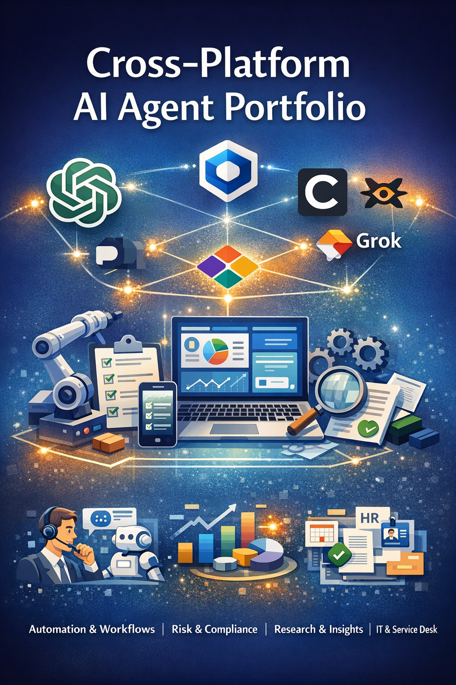

# Agentic AI Automation Playbook



Portfolio repository showcasing agent design, evaluation, orchestration, and low-code automation use cases across enterprise and cross-platform environments.

## Overview

This repository presents an anonymized portfolio of agentic AI and workflow automation use cases relevant to product strategy, operational transformation, and enterprise delivery. It demonstrates how I approach agent design, workflow orchestration, evaluation, guardrails, human-in-the-loop review, and adoption planning.

This repository is intended to demonstrate how I think and work as a:

- AI Product Manager
- Product Owner
- Process Engineer

## Quick Links

- [Agent Overview](agent-overview.md)
- [Enterprise Use Cases](enterprise-use-cases.md)
- [Cross-Platform Agent Portfolio](cross-platform-agent-portfolio.md)
- [Evaluation and Guardrails](evaluation-and-guardrails.md)
- [Low-Code and Automation Platforms](low-code-and-automation-platforms.md)
- [Adoption and Operating Model](adoption-and-operating-model.md)

## Context

Organizations are increasingly using AI agents and workflow automation to improve speed, consistency, decision support, and operational scale. Strong agent design requires more than prompt creation. It requires clear use-case selection, workflow orchestration, evaluation discipline, escalation paths, and alignment between business value and practical delivery.

This repository shows how I would structure and communicate agentic AI work through practical portfolio artifacts.

## Delivered Outcomes

Representative outcomes from agent and workflow automation work include:

- Reduced more than 3,000 manual actions per month through automation and improved compliance visibility.
- Cut vendor invoice cycle time in half through AI-assisted triage and approval routing.
- Reduced misrouted IT tickets by 40% through automated classification and assignment.
- Deflected up to 60% of L1 support tickets with AI-powered self-service assistance.
- Reduced onboarding time by 35% and improved day-one readiness through workflow automation.

## Focus Areas

- agent design and orchestration
- workflow automation
- evaluation and quality review
- human-in-the-loop operating models
- guardrails and escalation paths
- low-code and automation platforms
- enterprise use-case framing
- adoption and product strategy

## Example Work Themes

This portfolio is informed by workflow automation and GPT/agent projects across areas such as:

- risk and compliance
- finance operations
- ITSM and support
- HR service delivery
- product and workflow design
- research and analysis
- cross-platform automation

## Example Problem Space

Teams often face repetitive manual work, fragmented workflows, inconsistent routing, slow handoffs, unclear escalation paths, and limited documentation for AI-assisted processes. Agentic AI can improve these workflows when use cases are selected carefully and supported by strong evaluation, governance, and operational design.

## My Role

In this portfolio example, I demonstrate how I would contribute across:

- AI use-case identification
- agent and workflow design
- prompt and interaction design
- orchestration planning
- evaluation and quality criteria
- human-in-the-loop review design
- low-code automation strategy
- stakeholder communication and adoption planning

## What This Repository Includes

- agent overview and design context
- enterprise agent use-case examples
- cross-platform agent portfolio framing
- evaluation and guardrails thinking
- low-code and automation platform considerations
- adoption and operating model guidance

## Agentic AI Approach

My approach to agentic AI and automation includes:

1. Start with the workflow or business problem, not the model
2. Define where AI adds value versus where human review is required
3. Design clear inputs, outputs, routing, and escalation paths
4. Evaluate quality, reliability, and operational fit
5. Use low-code and automation platforms where they support speed and scale
6. Treat adoption, governance, and measurement as part of the product

## Example Deliverables

This repository includes documents such as:

- `agent-overview.md`
- `enterprise-use-cases.md`
- `cross-platform-agent-portfolio.md`
- `evaluation-and-guardrails.md`
- `low-code-and-automation-platforms.md`
- `adoption-and-operating-model.md`

## Repository Structure

```text
agentic-ai-automation-playbook/
│
├── README.md
├── agent-overview.md
├── enterprise-use-cases.md
├── cross-platform-agent-portfolio.md
├── evaluation-and-guardrails.md
├── low-code-and-automation-platforms.md
├── adoption-and-operating-model.md
└── images/
    └── cover.png
```
## Key Themes
Agentic AI
Workflow automation
Product strategy
Human-in-the-loop design
Evaluation and guardrails
Low-code automation
Enterprise operating models
Cross-platform AI enablement

## Confidentiality Note

All content in this repository is anonymized and intended for portfolio use. Any examples are adapted to avoid sharing proprietary, confidential, or sensitive business information.

## About Me

I build products and operational solutions at the intersection of:

AI/ML product strategy
agentic AI and workflow automation
product ownership
process engineering
enterprise transformation

My background includes AI risk modeling, workflow automation, ServiceNow product ownership, process engineering, and a broad portfolio of agent/GPT use cases across enterprise and cross-functional domains.

## Connect
LinkedIn: https://www.linkedin.com/in/christopher-d-cole/
Location: San Antonio, Texas
